- 🎓 National Taipei University of Technology (NTUT)
- 🔍 Discuess me about **Trade, Strategies, Python, XQ**
- 📫 How to reach me <michael1220zhen@gmail.com>

─────────────────────────

**How to reach me :**

 &nbsp;

  
  
  
  <code style="font-size: 18px;">zhennnnn20</code>

 

**Languages and Tools :**

  
  <a href="https://www.xq.com.tw/" target="_blank">
    

 

─────────────────────────
